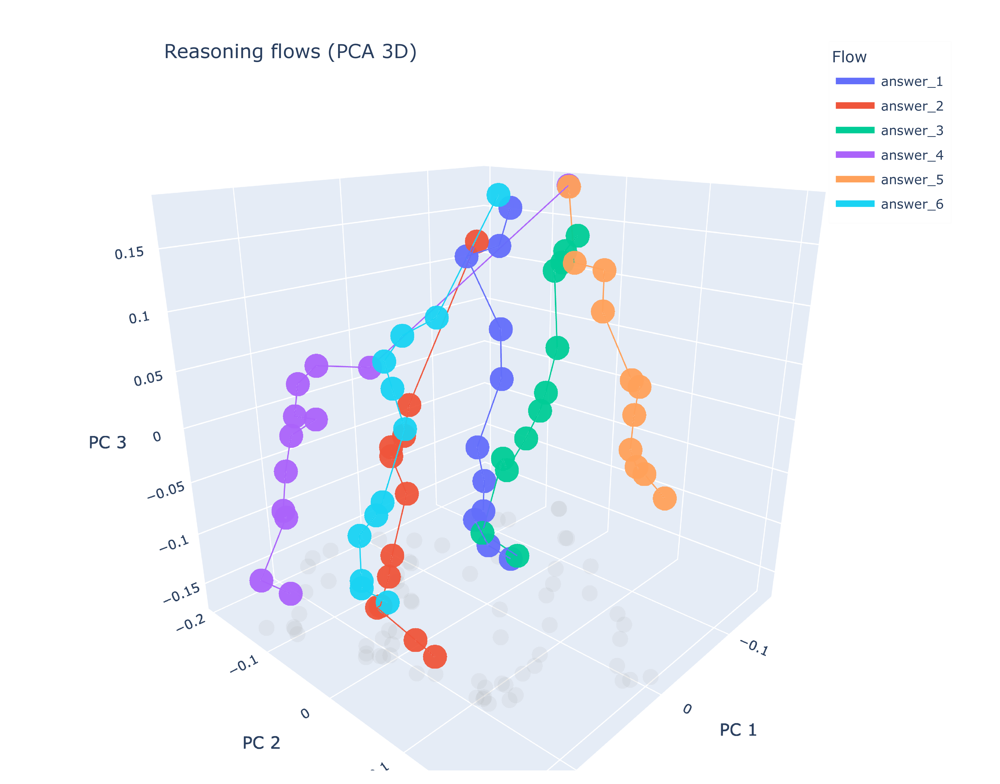
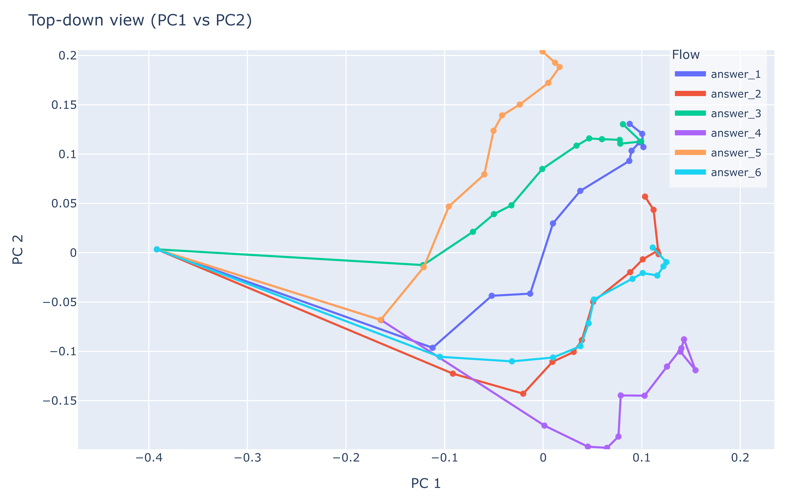
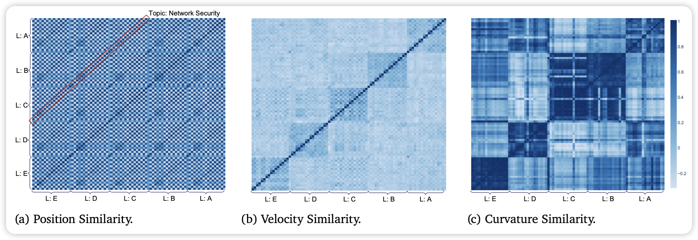

# The Geometry of Reasoning: Flowing Logics in Representation Space

[](https://arxiv.org/pdf/2510.09782)
[](https://github.com/MasterZhou1/Reasoning-Flow)
[](https://huggingface.co/datasets/MasterZhou/Reasoning-Flow)


**Authors:**
[**Yufa Zhou***](https://masterzhou1.github.io/), [**Yixiao Wang***](https://yixiao-wang-stats.github.io/), [**Xunjian Yin***](https://xunjianyin.github.io/),
[**Shuyan Zhou**](https://www.shuyanzhou.com/), [**Anru R. Zhang**](https://anruzhang.github.io/)

**Duke University**

*Equal contribution

---


This repo accompanies the paper “[The Geometry of Reasoning: Flowing Logics in Representation Space](https://arxiv.org/pdf/2510.09782)” and provides code to: (i) generate carrier-invariant formal logic datasets, (ii) extract per-step hidden-state embeddings from LLMs, and (iii) quantify and visualize logic and semantic structures via similarity analyses.


## Introduction

We study how large language models (LLMs) **reason through their embeddings** by introducing a **geometric framework of reasoning flows**, where reasoning unfolds as trajectories in representation space.


By **disentangling logic from semantics**—using identical natural deduction propositions expressed through diverse semantic carriers—we test whether LLMs internalize logical structure beyond surface form.
Our framework links reasoning to **geometric quantities** such as **position, velocity, and curvature**, enabling formal analysis of concept manifolds.


We show that:

1. **LLM reasoning forms smooth flows** in embedding space.
2. **Logical statements act as local controllers** governing the velocity of these flows.


Using learned representation of trained LLMs, we visualize and quantify reasoning dynamics, offering **both theoretical foundations and empirical tools** for studying interpretability and reasoning behavior.


## Key Findings

Experiments on **Qwen3 hidden states** using our **carrier-invariant logic dataset** reveal that:

* **Order-0 (positions):** Embeddings cluster by surface-level semantics, such as topic and language.
* **Order-1 (velocities):** Trajectories sharing the same logical structure exhibit alignment—even when the underlying semantics (topic or language) differ.
* **Order-2 (Menger curvature):** This higher-order measure further intensifies the logic component, highlighting logical structure as a principal factor across flows.

---

We also **formalize mappings** among *input*, *concept*, *logic*, and *representation* spaces for understanding and measuring reasoning flows.
See the full paper for theoretical details:
📄 [**The Geometry of Reasoning: Flowing Logics in Representation Space**](https://arxiv.org/pdf/2510.09782)


## Visualizations

**PCA Visualization**

To build intuition, we visualized reasoning flows using PCA on a selected MATH500 problem with six different answers.


| **3D PCA Trajectories**                                             | **2D PCA Projection**                                         |
|---------------------------------------------------------------------|---------------------------------------------------------------|
|   |  |
| *3D PCA trajectories. Flows are smooth and coherent on a low‑dimensional manifold.* | *2D PCA projection for an at‑a‑glance view of trajectory geometry.* |

---

**Qwen3 0.6B Similarity Matrices**

We evaluate Qwen3 0.6B on our dataset to verify our geometric reasoning framework.




- (a) Similarity (order‑0, positions). Semantic topics 
dominate clustering.
- (b) Similarity (order‑1, 
velocities). Logic‑matched flows align across 
topics/languages, revealing carrier‑invariant structure.
- (c) Similarity (order‑2, curvatures). The logic signal 
further strengthens beyond surface semantics.

You can reproduce and extend these figures with the scripts below or generate new carrier‑invariant datasets and re‑run the analyses end‑to‑end.

## Installation

```bash
python -m venv .venv && source .venv/bin/activate
pip install -r requirements.txt
# Install PyTorch appropriate for your system: https://pytorch.org/get-started/locally/
```

## Data

- Our data JSON: `data/all_final_data.json` (logic → list of records with `steps`, `topic`, `lang`).
- You can also generate new data using `generate_dataset.py` (OpenAI API or local HF model).

## 1) Hidden-state dynamics and figures

Compute step embeddings and visualize/quantify similarities:

```bash
python cot-hidden-dynamic.py \
  --hf_model /path/to/Qwen3-0.6B \
  --data_file data/all_final_data.json \
  --pooling step_mean --accumulation cumulative \
  --similarity_order 1 \
  --save_dir results/demo/Qwen3-0.6B
```

Outputs:
- PCA trajectory PDFs per logic group
- Global similarity matrix
- Saved embeddings and CSVs under `results/.../data/`

Batch runs: see `run_sweep.sh`. A tiny quickstart is in `cmd.sh`.

## 2) Aggregate group similarity (logic/topic/lang)

```bash
python compute_similarity_averages.py \
  --hf_models /path/to/Qwen3-0.6B,/path/to/Qwen3-1.7B \
  --data_file data/all_final_data.json \
  --orders 0,1,2,3 \
  --pooling step_mean --accumulation cumulative \
  --save_dir results/averages
```

Outputs per model: JSON and TSV with macro/micro means within logic/topic/language groups.

## 3) Generate dataset (optional)

Two modes:
- OpenAI: set `OPENAI_API_KEY` or pass `--openai_api_key`.
- Local HF: pass `--hf_model`.

Examples:

```bash
# OpenAI backend (natural reasoning rewrite)
export OPENAI_API_KEY=...  # or use --openai_api_key
python generate_dataset.py \
  --backend openai --model gpt-4o-mini \
  --logic_template prompt/logic_template.md \
  --topic_template prompt/topic_rewrite_template.md \
  --num_logics 5 --topics weather,finance,software \
  --languages en,de \
  --out data/generated_logic_topics.json

# Local HF backend
python generate_dataset.py \
  --backend hf --hf_model /path/to/instruct-model \
  --prompt_template prompt/prompt_natural.md \
  --seeds_file data/seeds.jsonl \
  --out data/generated_logic_topics.json
```


## Citation

If you find this useful, please cite the paper:

```
@article{zhou2025geometry,
title   = {The Geometry of Reasoning: Flowing Logics in Representation Space},
author  = {Zhou, Yufa and Wang, Yixiao and Yin, Xunjian and Zhou, Shuyan and Zhang, Anru R.},
journal = {arXiv preprint arXiv:2510.09782},
year    = {2025}
}
```

## Contact

😊 Questions? Ideas? Interested in collaborating on this exciting research?  

Feel free to reach out to Yufa Zhou at [yufa.zhou@duke.edu](mailto:yufa.zhou@duke.edu)—always happy to connect!


